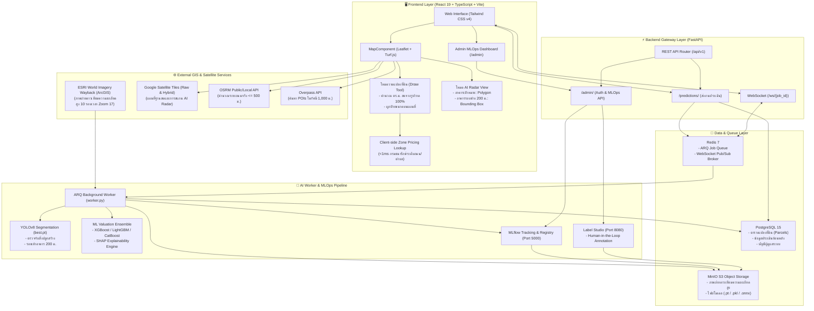
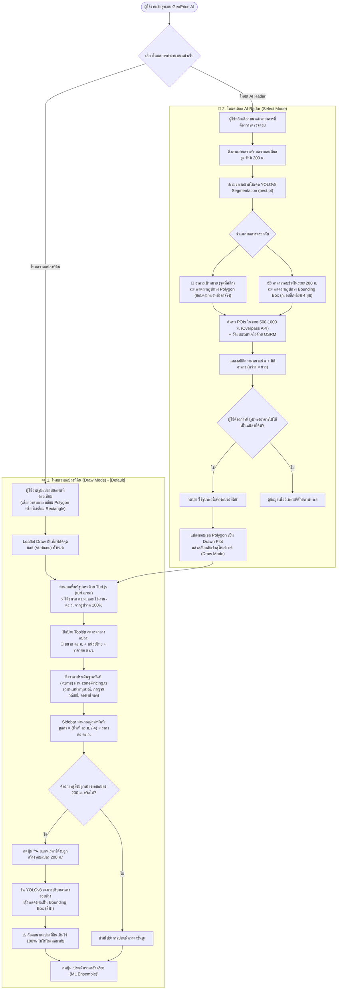
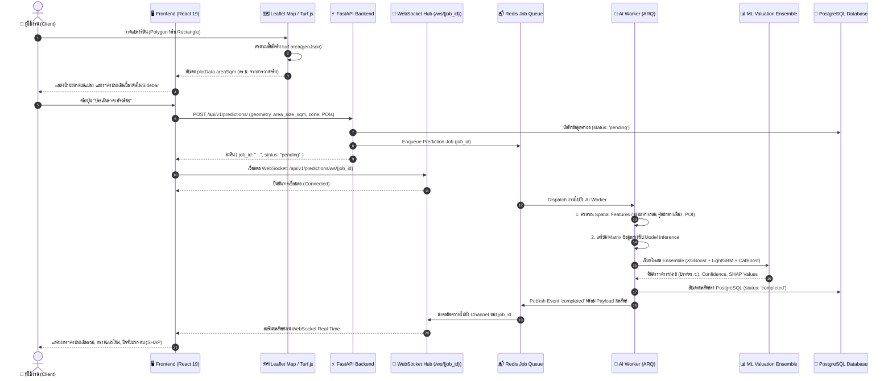
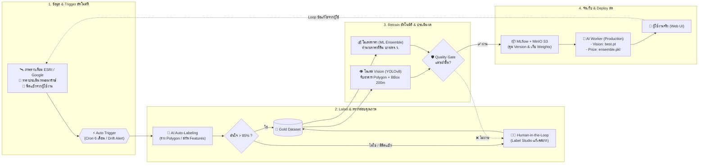

# GeoPrice AI - System Architecture & Workflow Diagrams

เอกสารนี้รวบรวมไดอะแกรมของระบบ **GeoPrice AI** ทั้งหมดในรูปแบบ **Mermaid Diagram** เพื่อให้สามารถนำไปเรนเดอร์ใน GitHub, Notion, Mermaid Live Editor หรือเครื่องมือ Markdown Viewer ได้ทันที

---

## 1. ภาพรวมสถาปัตยกรรมระบบทั้งหมด (System & Infrastructure Architecture)

แสดงโครงสร้างความสัมพันธ์ระหว่าง Frontend, Backend Gateway, Message Queue, AI Worker, MLOps Stack และบริการภายนอก

---

## 2. โฟลว์การทำงาน 2 โหมดหลัก (Dual-Mode Interactive Workflow)

แสดงความแตกต่างระหว่าง **โหมดวาดแปลงที่ดิน (Draw Mode)** ที่นับ ตร.ม. จากการวาดจริง กับ **โหมดเลือก AI Radar (Select Mode)** ที่ใช้โมเดล Vision

---

## 3. ซีเควนซ์ไดอะแกรมการประเมินราคาและส่งข้อมูล Real-Time (Sequence Diagram)

แสดงขั้นตอนการส่งคำขอประเมินราคาจากหน้าเว็บ ผ่าน WebSocket และ Worker แบบ Asynchronous

---

## 4. สถาปัตยกรรม MLOps & Continuous Learning Loop (Automated + Auto-Labeling + HITL)

แสดงกระบวนการเรียนรู้และปรับปรุงโมเดลอย่างต่อเนื่องแบบ **Automated Pipeline** ครอบคลุมทั้ง **โมเดลตรวจจับอาคาร (Vision Model)** และ **โมเดลทำนายราคาที่ดิน (Price Prediction Model)** พร้อมระบบคัดกรองระหว่าง **Auto-Labeling (โมเดลช่วย Label)** และ **Human-in-the-Loop (ผู้เชี่ยวชาญตรวจสอบ)**

### คำอธิบายองค์ประกอบสำคัญใน MLOps Loop ฉบับปรับปรุง:

1. **แหล่งภาพถ่ายดาวเทียมความละเอียดสูง (Satellite Imagery Sources)**:
   - **ESRI World Imagery Wayback (ArcGIS Living Atlas)**: แหล่งภาพถ่ายดาวเทียมความละเอียดสูง (Tile Zoom 17) ย้อนหลัง 10 ช่วงเวลาครึ่งปี (2022_01-06 จนถึง 2026_07-12) ดึงผ่านสคริปต์ `scripts/sync_all_wayback_periods.py` จัดเก็บใน MinIO S3 bucket `images/{period}/` สำหรับเทรนและประเมินการเปลี่ยนแปลงของสิ่งปลูกสร้างข้ามกาลเวลา (Spatio-Temporal Analysis)
   - **Google Satellite Tiles (Raw & Hybrid)**: แหล่งภาพถ่ายดาวเทียมความละเอียดสูงสำหรับการเรนเดอร์แผนที่ Interactive Leaflet และการสแกนเรดาร์ AI สดในรัศมี 200 ม.
   - *(หมายเหตุ: ระบบไม่ได้ใช้ Sentinel เนื่องจากภาพถ่ายของ Sentinel มีความละเอียดพิกเซลอยู่ที่ 10–20 เมตร ซึ่งหยาบเกินกว่าจะจำแนกขอบเขตหลังคาอาคารและแปลงที่ดินได้)*
2. **ระบบอัตโนมัติ (Automated Pipeline)**:
   - มี **Automated Triggers** ตรวจสอบรอบเวลา (Scheduled Cron เช่น อัปเดตรอบภาพดาวเทียม ESRI Wayback ทุก 6 เดือน), ปริมาณข้อมูลใหม่ที่สะสม, และการตรวจจับความคลาดเคลื่อน (Drift Detection) เพื่อเริ่มกระบวนการ Retraining โดยอัตโนมัติ
   - มี **Automated Quality Gate** ตรวจสอบคุณภาพโมเดลเทียบกับเกณฑ์และโมเดลรุ่น Production เดิม หากผ่านเกณฑ์จะทำการ Promote สู่ Production อัตโนมัติแบบ Zero-Downtime
3. **การติดป้ายกำกับ (Auto-Labeling + Human-in-the-Loop)**:
   - **Auto-Labeling (AI Pre-annotation)**: ใช้โมเดลปัจจุบันร่าง Polygon อาคารและสกัด Feature ราคาให้อัตโนมัติ ช่วยลดภาระงานคนลงกว่า 70-80%
   - **Confidence Triage**: ข้อมูลที่มั่นใจสูงจะผ่านเข้าชุดข้อมูลโดยตรง ส่วนเคสที่ความมั่นใจต่ำหรือมีข้อท้วงติงจาก User Feedback จะส่งต่อให้ **ผู้เชี่ยวชาญ (Human-in-the-Loop)** ปรับแก้ใน Label Studio
4. **การแยกโมเดลทั้ง 2 ชนิดชัดเจน (Vision Model & Price Prediction Model)**:
   - **โมเดลที่ 1 (Vision Model - YOLOv8 Segmentation `best.pt`)**: รับผิดชอบตรวจจับรอยเท้าอาคาร (Polygon) และบริบทอาคารรอบข้าง 200 ม. (Bounding Box)
   - **โมเดลที่ 2 (Price Prediction Model - ML Valuation Ensemble `ensemble_model.pkl`)**: รับผิดชอบทำนายราคาประเมินที่ดิน (บาท/ตร.ว. และมูลค่ารวม) พร้อมค่า SHAP Values
   - ทั้ง 2 โมเดลถูกจัดเก็บ เวอร์ชันนิ่งใน **MLflow Model Registry** และเก็บบันทึก Artifacts ไว้ใน **MinIO S3** พร้อม Deploy เข้าสู่ AI Worker คู่ขนานกันอย่างเป็นระบบ

