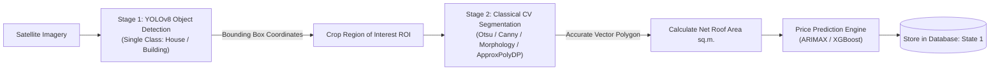
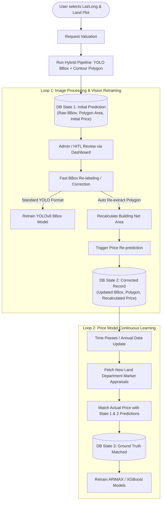
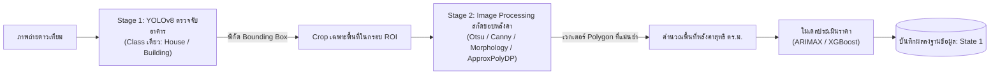
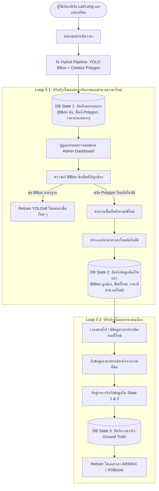

# System Improvement Action Plan (Ecosystem & Hybrid Vision Pipeline)
> **Reference:** Advisor Feedback in [transcript.md](file:///D:/Geo-price/docs/transcripts/transcript.md)  
> **Status:** Ready for implementation  
> **Target Date:** Next Day Development Sprint  
> 
> 🌐 **Language Quick Links:** [English Version](#-english-version) | [ฉบับภาษาไทย (Thai Version)](#-ฉบับภาษาไทย-thai-version)

---

# 🇬🇧 English Version

## 📌 1. Executive Summary & Problem Background

From the advisor's critique, the core challenges and required paradigm shifts are:

1. **Eliminate Subjective User Feedback on Prices:**
   - Previous flow: Users were asked whether the predicted price was "too high / too low / reasonable."
   - Advisor critique: The model predicts **future prices** (e.g., 1–3 years ahead). Neither regular users nor appraisers have ground truth for future prices today. User opinion has severe cognitive/financial bias (buyers always think prices are too high).
   - **Decision:** Remove the subjective price feedback form completely.

2. **Redefine User Role as Data Generator (Trigger):**
   - The user's role is not reviewing predictions, but acting as a trigger point for spatial data collection.
   - When a user selects a location (Lat/Long, land plot boundary), the system logs this as an active Area of Interest (AOI).

3. **Hybrid Vision Pipeline (Resolving YOLO Segmentation Issues):**
   - Advisor requirement: YOLO should strictly perform **Bounding Box Object Detection** with a single output class (`House/Building`), rather than forced complex polygon segmentation or multi-class classification.
   - Engineering requirement: The price prediction models (ARIMAX / XGBoost) require the **exact building roof area (sq.m.)**, not the padded bounding box area.
   - **Decision:** Adopt a **2-Stage Hybrid Vision Pipeline**:
     - **Stage 1 (YOLO):** Object detection predicting tight bounding boxes.
     - **Stage 2 (Contour Polygon Extraction):** Classical Computer Vision (Otsu Thresholding, Canny Edge, Morphological operations, and `cv2.findContours` / `cv2.approxPolyDP` / GrabCut) to extract vector polygons and calculate net building area inside each bounding box.

4. **Multi-State Database Versioning:**
   - Retain initial predictions, update with re-labeled/re-calculated values, and match against ground truth when future market data becomes available.

---

## 🏗️ 2. Architectural Blueprint: 2-Stage Hybrid Vision Pipeline

### Stage 1: YOLO Object Detection
- **Model:** YOLOv8 custom architecture / fine-tuned.
- **Output Layer:** Single-class (`house`).
- **Annotation Format:** Standard rectilinear bounding box `(x_center, y_center, width, height)`.
- **Advantage:** Fast convergence, zero multi-class confusion, high mAP50, and fully aligned with advisor guidance.

### Stage 2: Contour Polygon Extraction (Building Isolation)
- **Input:** Cropped image patch bounded by Stage 1 Bounding Box.
- **Processing Steps:**
  1. **Color Conversion & Preprocessing:** Convert ROI to Grayscale / Lab color space; apply Bilateral Filter to preserve sharp roof edges while suppressing image noise.
  2. **Thresholding & Edge Detection:** Adaptive Thresholding (Otsu) combined with Canny Edge Detection.
  3. **Morphological Filtering:** Morphological Close (`cv2.morphologyEx`) with rectangular structuring elements to seal roof holes and eliminate shadows/soil clutter.
  4. **Contour Extraction:** `cv2.findContours(cv2.RETR_EXTERNAL, cv2.CHAIN_APPROX_SIMPLE)`.
  5. **Polygon Simplification:** `cv2.approxPolyDP` to obtain clean, sharp building vertices representing roof structures.
- **Output:** Vector coordinates (GeoJSON polygon) and accurate building footprint area ($m^2$).

---

## 🔄 3. Closed-Loop Retraining Ecosystem

---

## 🗄️ 4. Database Schema Requirements (Multi-State Versioning)

Each prediction record must maintain state history to support the complete lifecycle:

| Field Name | Type | Description |
| :--- | :--- | :--- |
| `id` | UUID | Unique prediction ID |
| `latitude`, `longitude` | Float | Center coordinate of target plot |
| `raw_image_url` | String | Satellite image patch stored in MinIO |
| **State 1: Initial** | | |
| `initial_bboxes` | JSON | YOLO detection output boxes `[[x1, y1, x2, y2, conf], ...]` |
| `initial_polygons` | JSON | Stage 2 contour vertices and calculated total area ($m^2$) |
| `initial_price_prediction` | Float | Initial estimated price from ARIMAX / XGBoost |
| `target_prediction_year` | Integer | Forecast year requested (e.g., 2027) |
| **State 2: Re-labeled & Corrected** | | |
| `corrected_bboxes` | JSON | Human-corrected bounding box annotations |
| `recalculated_polygons` | JSON | Re-extracted polygons and updated area ($m^2$) |
| `recalculated_price` | Float | Price re-computed after geometric correction |
| `is_verified` | Boolean | Flag indicating HITL review completion |
| **State 3: Ground Truth Evaluation** | | |
| `actual_market_price` | Float | Official appraisal / transaction price fetched later |
| `actual_recorded_at` | DateTime | Timestamp when official appraisal became available |
| `error_metrics` | JSON | Percentage error comparing State 1/2 against actual price |

---

## 📋 5. Implementation Status & Checklist (Completed & Live Verified ✅)

### Phase 1: Separation of Workers & Task Queues ✅
- [x] **Inference vs Training Separation:** Separated AI Worker into `geoprice-ai-worker-inference` (`arq:queue_inference`, delay=0.1s) and `geoprice-ai-worker-trainer` (`arq:queue_training`, 2 jobs, 7200s timeout).
- [x] **No Task Duplication:** Live verified on Docker Compose with dedicated concurrency pools.
- [x] **Frontend Flow:** Cleaned up subjective survey widget; converted to AOI Trigger flow where map click logs parcel bounds and triggers radar scan.

### Phase 2: Hybrid Vision Pipeline Implementation ✅
- [x] **YOLO Refactor (Stage 1):** Verified YOLOv8 detects houses/buildings strictly as rectilinear Bounding Boxes (`house`, Class 0) without distorted polygons.
- [x] **Contour Extraction Module (Stage 2):** Created `contour_extractor.py` implementing Bilateral Filter $\rightarrow$ Otsu Thresholding $\rightarrow$ Morphological Close $\rightarrow$ `cv2.findContours` $\rightarrow$ `cv2.approxPolyDP`, returning net building area ($m^2$) and vector polygon points. Cast to `np.float32` for OpenCV 5 compatibility.
- [x] **Inference Integration:** Vision radar scan combines OpenCV target building net area + YOLO surrounding count into ARIMAX/XGBoost pricing model.

### Phase 3: Database Multi-State Schema & Pipeline Trigger ✅
- [x] **Database Schema Migration:** Added `raw_image_url`, State 1 (`initial_bboxes`, `initial_polygons`, `initial_price_prediction`), State 2 (`corrected_bboxes`, `recalculated_polygons`, `recalculated_price`, `is_verified`), and State 3 (`actual_market_price`, `actual_recorded_at`, `error_metrics`) to `price_predictions` table.
- [x] **Automatic State 1 Persist:** Radar scan automatically persists LandPlot, Job, and PricePrediction (State 1) with `is_verified=False`.
- [x] **Recalculation Endpoint (State 2):** `POST /api/v1/admin/triggers/correct-and-recalculate` dispatches contour re-extraction to worker, calculates updated area & price, marks `is_verified=True`, and writes YOLO annotation to MinIO.
- [x] **Cadastral Ground Truth Matching (State 3):** `POST /api/v1/admin/price-model/ground-truth-match` matches official land appraisals, calculates MAPE/MAE error metrics, and dispatches price model retraining.
- [x] **Dual-Source Vision Retraining:** `POST /api/v1/admin/vision-model/trigger-retrain` ingests user AOI BBoxes and 6-month scheduled satellite imagery.

### Phase 4: Frontend HITL & Multi-State Dashboard ✅
- [x] **Notification Center:** Header bell popover alerts admin of pending unverified user sessions (`GET /api/v1/admin/triggers/pending`).
- [x] **Quick Polygon & BBox Editor:** Interactive SVG canvas supporting BBox vertex adjustment, State 2 recalculation, and Vision Retrain triggering.
- [x] **Multi-State Versioning Tab:** Live table comparing State 1 (Initial) vs State 2 (Recalculated) vs State 3 (Ground Truth Actual) with error metrics and one-click retrain.
- [x] **Zero TypeScript Errors:** Verified with `npm run build` passing cleanly.

---
---

# 🇹🇭 ฉบับภาษาไทย (Thai Version)

## 📌 1. บทสรุปและที่มาของปัญหา (Executive Summary)

จากคำแนะนำและข้อวิจารณ์ของอาจารย์ใน [transcript.md](file:///D:/Geo-price/docs/transcripts/transcript.md) สรุปประเด็นสำคัญที่ต้องปรับเปลี่ยนกระบวนทัศน์ของระบบได้ดังนี้:

1. **ตัดระบบให้ User กดประเมินความสมเหตุสมผลของราคาทิ้ง:**
   - โฟลว์เดิม: มีแบบสอบถามให้ผู้ใช้เลือกว่าราคาประเมิน "สูงเกินไป / ต่ำเกินไป / สมเหตุสมผล"
   - ข้อทักท้วงของอาจารย์: ระบบทำนายราคาใน **อนาคต** (เช่น อีก 1-3 ปีข้างหน้า) ณ ปัจจุบันยังไม่มีใครรู้ราคาจริง ไม่ว่าจะเป็นคนทั่วไปหรือผู้ประเมิน นอกจากนี้ความเห็นของผู้ใช้ยังมี Bias สูงมาก (ผู้ซื้อมักรู้สึกว่าราคาแพงเสมอ)
   - **แนวทางแก้ไข:** ถอดฟอร์มสอบถามความเห็นเรื่องราคาออกทั้งหมด

2. **เปลี่ยนบทบาทของ User เป็น "ผู้สร้างข้อมูล (Data Trigger)":**
   - หน้าที่ของผู้ใช้ไม่ใช่การรีวิวโมเดล แต่คือการเข้ามาเป็นตัวกระตุ้นให้ระบบจัดเก็บชุดข้อมูลพิกัดเชิงพื้นที่ (Area of Interest: AOI)
   - ทุกครั้งที่ผู้ใช้เลือกพิกัด Lat/Long หรือขอบเขตแปลงที่ดิน ระบบจะบันทึกภาพถ่ายและจุดดังกล่าวไว้เป็นฐานข้อมูลสำหรับปรับปรุงระบบต่อไป

3. **นำสถาปัตยกรรม Hybrid Vision มาใช้ (แก้ปัญหาเรื่องการเทรน YOLO):**
   - ข้อกำหนดของอาจารย์: YOLO ต้องทำหน้าที่แค่ **ตีกรอบสี่เหลี่ยม (Bounding Box)** เท่านั้น และควรมีเพียง Class เดียวคือ `House/Building` ไม่ควรฝืนเทรนเป็น Polygon หรือปล่อยให้มีหลาย Class จนสับสน
   - ข้อกำหนดของโมเดลราคา: โมเดลประเมินราคา (ARIMAX / XGBoost) ต้องการ **พื้นที่สุทธิของหลังคาอาคาร (ตร.ม.)** จริง ๆ ไม่สามารถใช้พื้นที่กรอบสี่เหลี่ยม BBox ซึ่งติดพื้นหญ้า ถนน และเงา มาคำนวณได้
   - **แนวทางแก้ไข:** ใช้ระบบ **2-Stage Hybrid Vision Pipeline**:
     - **Stage 1 (YOLO):** ทำ Object Detection ตีกรอบสี่เหลี่ยมระบุตำแหน่งบ้านแต่ละหลัง
     - **Stage 2 (Contour Polygon Extraction):** ใช้เทคนิค Classical Computer Vision (Otsu Thresholding, Canny Edge, Morphological operations, และ `cv2.findContours` / `approxPolyDP` / GrabCut) ตัดเฉพาะขอบหลังคาบ้านออกมาเป็นเวกเตอร์ Polygon เพื่อคำนวณพื้นที่สุทธิ

4. **การออกแบบฐานข้อมูลแบบรองรับหลายสถานะ (Multi-State Versioning):**
   - บันทึกผลลัพธ์รอบแรก, อัปเดตผลลัพธ์เมื่อมีการตรวจแก้ Label และคำนวณราคาใหม่ และจับคู่เทียบกับราคาจริงเมื่อข้อมูลราคาในอนาคตถูกเผยแพร่

---

## 🏗️ 2. แผนผังสถาปัตยกรรม: 2-Stage Hybrid Vision Pipeline

### Stage 1: YOLO Object Detection
- **หน้าที่:** ตรวจจับตำแหน่งบ้านและสิ่งปลูกสร้าง
- **Output:** พิกัด Bounding Box สี่เหลี่ยมตรง ๆ `(x_center, y_center, width, height)`
- **จุดเด่น:** เทรนง่าย ค่าความแม่นยำ (mAP50) สูง โมเดลไม่สับสน และสอดคล้องกับคำแนะนำของอาจารย์ 100%

### Stage 2: Contour Polygon Extraction (การสกัดรูปทรงหลังคา)
- **ข้อมูลขาเข้า:** ภาพย่อยที่ถูก Crop มาจากกรอบ Bounding Box ของ Stage 1
- **ขั้นตอนการประมวลผล:**
  1. **Color Conversion & Preprocessing:** แปลงภาพเป็น Grayscale หรือ Color Space ที่เหมาะสม และใช้ Bilateral Filter ลบสัญญาณรบกวนโดยยังคงความคมชัดของขอบหลังคา
  2. **Thresholding & Edge Detection:** ใช้ Adaptive Thresholding (Otsu) ร่วมกับ Canny Edge Detection ตรวจจับเส้นขอบ
  3. **Morphological Filtering:** ใช้ Morphological Close (`cv2.morphologyEx`) เชื่อมรอยต่อของหลังคา และตัดเงาหรือพื้นดินรอบข้างออก
  4. **Contour Extraction:** สกัดเส้นรอบรูปด้วย `cv2.findContours`
  5. **Polygon Simplification:** ลดทอนจุดให้กลายเป็นเหลี่ยมหลังคาที่คมชัดด้วย `cv2.approxPolyDP`
- **ข้อมูลขาออก:** พิกัดรูปทรง Polygon (GeoJSON) และขนาดพื้นที่หลังคาสุทธิ (ตารางเมตร)

---

## 🔄 3. วงจรอีโคซิสเต็มและการเรียนรู้แบบวงปิด (Closed-Loop Retraining Ecosystem)

---

## 🗄️ 4. ข้อกำหนดการออกแบบฐานข้อมูล (Database Multi-State Schema)

ข้อมูลการประเมินแต่ละรายการจะต้องเก็บประวัติและสถานะการทำงานเพื่อรองรับวงจร Ecosystem:

| ชื่อฟิลด์ | ประเภทข้อมูล | คำอธิบาย |
| :--- | :--- | :--- |
| `id` | UUID | รหัสประจำรายการประเมิน |
| `latitude`, `longitude` | Float | พิกัดกึ่งกลางของแปลงที่ดินเป้าหมาย |
| `raw_image_url` | String | ลิงก์รูปถ่ายดาวเทียมที่จัดเก็บใน MinIO S3 |
| **State 1: ข้อมูลเริ่มต้น (Initial)** | | |
| `initial_bboxes` | JSON | พิกัด BBox ดิบที่ได้จาก YOLO `[[x1, y1, x2, y2, conf], ...]` |
| `initial_polygons` | JSON | จุดยอด Polygon และพื้นที่รวมที่สกัดได้ในรอบแรก ($m^2$) |
| `initial_price_prediction` | Float | ราคาประเมินที่ทำนายได้ครั้งแรกจากโมเดล |
| `target_prediction_year` | Integer | ปีเป้าหมายที่ต้องการทำนาย (เช่น 2027) |
| **State 2: ข้อมูลที่แก้ไขและคำนวณซ้ำ (Re-labeled & Corrected)** | | |
| `corrected_bboxes` | JSON | ข้อมูล Bounding Box ที่ผ่านการตรวจแก้โดยคน |
| `recalculated_polygons` | JSON | Polygon และพื้นที่ที่สกัดใหม่โดยอัตโนมัติ ($m^2$) |
| `recalculated_price` | Float | ราคาประเมินที่คำนวณใหม่อัตโนมัติหลังแก้พื้นที่ |
| `is_verified` | Boolean | แฟล็กระบุว่ารายการนี้ได้รับการตรวจสอบแล้ว |
| **State 3: ข้อมูลราคาจริงในอนาคต (Ground Truth Evaluation)** | | |
| `actual_market_price` | Float | ราคาประเมินราชการหรือราคาซื้อขายจริงที่ดึงเข้ามาในภายหลัง |
| `actual_recorded_at` | DateTime | วันที่และเวลาที่บันทึกข้อมูลราคาจริง |
| `error_metrics` | JSON | ค่าความคลาดเคลื่อนเปรียบเทียบระหว่างราคาทำนายกับราคาจริง |

---

## 📋 5. สถานะและความคืบหน้าการทำงาน (Completed & Live Verified ✅)

### เฟส 1: แยก Worker และคิวงานเพื่อประสิทธิภาพสูงสุด ✅
- [x] **แยก Worker Inference ออกจาก Retrain:** แยกเป็น `geoprice-ai-worker-inference` (คิว `arq:queue_inference`) และ `geoprice-ai-worker-trainer` (คิว `arq:queue_training`) ป้องกันปัญหางานเทรนหน่วงงานประเมินผลหน้าเว็บ
- [x] **แก้ปัญหางานซ้ำซ้อน:** ทดสอบรันจริงบน Docker พบว่า Worker แต่ละตัวรับงานเฉพาะคิวของตนเอง ไม่มีการแย่งงานหรือประมวลผลซ้ำ
- [x] **ปรับปรุง User Flow:** ตัดแบบสอบถามความเห็นราคาออกทั้งหมด เปลี่ยนมาใช้การเลือกแปลงที่ดินเป็นตัวกระตุ้น (AOI Trigger)

### เฟส 2: พัฒนาระบบ Hybrid Vision Pipeline ✅
- [x] **ปรับแต่ง YOLO (Stage 1):** กำหนดให้ตรวจจับอาคารเป็น Bounding Box สี่เหลี่ยมผืนผ้า Class เดียว (`House/Building`) 100% สอดคล้องกับคำแนะนำของอาจารย์
- [x] **โมดูลสกัดรูปทรงหลังคา (Stage 2):** สร้าง `contour_extractor.py` (Bilateral Filter $\rightarrow$ Otsu Thresholding $\rightarrow$ Morphological Close $\rightarrow$ `cv2.findContours` $\rightarrow$ `cv2.approxPolyDP`) คำนวณพื้นที่หลังคาสุทธิ ($m^2$) อย่างแม่นยำ พร้อมแปลงชนิดข้อมูลเป็น `np.float32` รองรับ OpenCV 5
- [x] **เชื่อมต่อกับโมเดลประเมินราคา:** ผสานพื้นที่สุทธิจาก OpenCV + จำนวนอาคารโดยรอบจาก YOLO เข้าสู่ ARIMAX / XGBoost

### เฟส 3: โครงสร้างฐานข้อมูล Multi-State Versioning และ Pipeline ✅
- [x] **Migrate ฐานข้อมูล PostgreSQL:** เพิ่มคอลัมน์ State 1 (`initial_*`), State 2 (`corrected_*`), State 3 (`actual_*`) ในตาราง `price_predictions`
- [x] **บันทึก State 1 อัตโนมัติ:** เมื่อ User ใช้งานเรดาร์ ระบบจะบันทึกผลการทำนายแรกและ BBoxes ทันทีโดยมีสถานะ `is_verified=False`
- [x] **API คำนวณซ้ำ State 2:** `POST /api/v1/admin/triggers/correct-and-recalculate` ส่งงานให้ Worker สกัด Polygon จาก BBox ที่แก้ใหม่ คำนวณราคาใหม่ บันทึกเป็น State 2 (`is_verified=True`) และอัปเดตไฟล์ Label ลง MinIO
- [x] **API จับคู่ราคาจริง State 3:** `POST /api/v1/admin/price-model/ground-truth-match` นำราคาประเมินราชการมาจับคู่ คำนวณค่า MAPE/MAE และสั่ง Retrain โมเดลราคาอัตโนมัติ
- [x] **API สั่ง Retrain โมเดลตรวจจับภาพ:** `POST /api/v1/admin/vision-model/trigger-retrain` ดึงข้อมูล 2 แหล่ง (BBoxes จาก User + ภาพรอบ 6 เดือนจาก MinIO) เข้าคิวเทรน

### เฟส 4: ส่วนติดต่อผู้ใช้ Admin HITL & Multi-State Dashboard ✅
- [x] **กระดิ่งแจ้งเตือน (Notification Center):** แสดง Badge เตือนเมื่อมีรายการใหม่จาก User ที่รอการตรวจสอบ
- [x] **Quick BBox & Polygon Editor:** หน้าจอตรวจแก้กรอบ BBox แบบโต้ตอบ ลากปรับมุมได้ พร้อมปุ่มคำนวณพื้นที่ใหม่และอนุมัติ State 2
- [x] **แท็บ Multi-State Versioning:** ตารางเปรียบเทียบ State 1 vs State 2 vs State 3 พร้อมแสดงค่าความคลาดเคลื่อน MAPE และปุ่ม Retrain โมเดลราคา
- [x] **TypeScript ผ่าน 100%:** ทดสอบด้วย `npm run build` ผ่านสมบูรณ์ ไร้ข้อผิดพลาด
